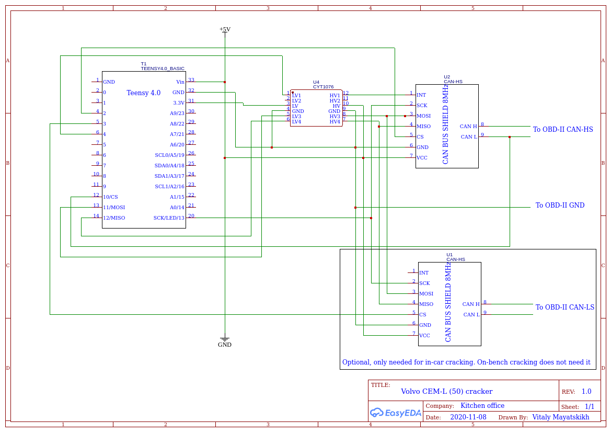
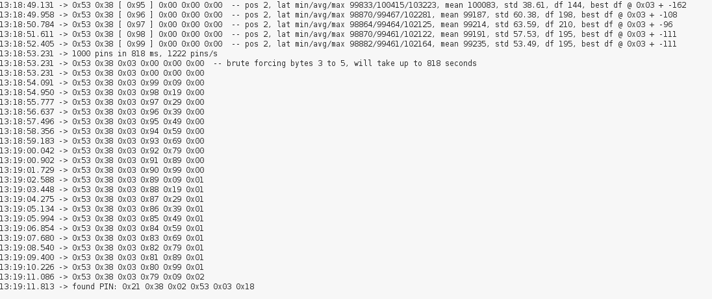

# Volvo 2005-2007 CEM-L pin cracker via OBD

A research project grown out of curiosity. Cracks 6 bytes of pin code via 500 Kbps CAN-bus in about 10 minutes.

Big thanks to an unidentified hacker from western Germany for hints!

