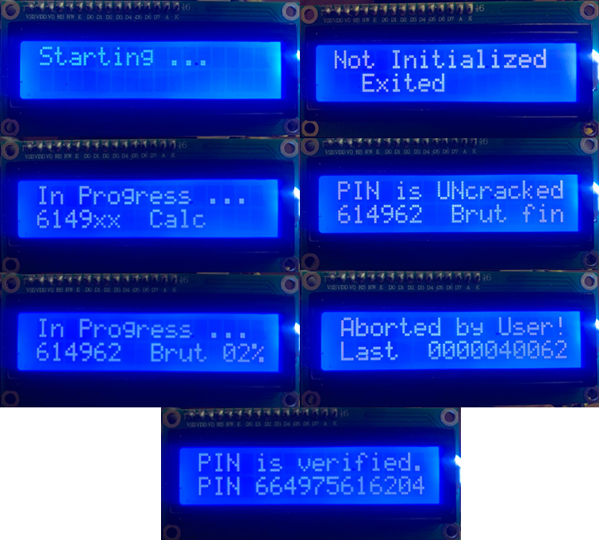

# Volvo CEM pin cracker via OBD

This is a fork of original Volvo CEM pin cracker via OBD https://github.com/vtl/volvo-cem-cracker
Please visit the link above to view details of the project.

This implementation has some minor features, which could be useful to someone:
1) Abort button to exit from cracking process with ECUs exiting from programming mode. Pressing Abort button on brute-force stage leads to displaying last tried brute-force value.
2) Allow to start brute-forcing from any value.
3) i2c LCD support. In case


Let's look at this implementation as managed solution, all descriptions below assume that HW part is OK.

## Possible issues and fixes
Depending on your CEM model, you may face some issues with PIN decoding. Here are some examples and recommendations.

#### Unable to decode 3rd byte.
Cracker decodes first 2 bytes, but the third byte is always different so PIN cannot be decoded. For example:

```
Attempt 1:
21:54:30.212 -> Candidate PIN 32 78 79 -- -- -- : brute forcing bytes 3 to 5 (3 bytes), will take up to 646 seconds
...
Attempt 2:
22:30:45.288 -> Candidate PIN 32 78 78 -- -- -- : brute forcing bytes 3 to 5 (3 bytes), will take up to 646 seconds

Attempt 3:
23:06:12.024 -> Candidate PIN 32 78 02 -- -- -- : brute forcing bytes 3 to 5 (3 bytes), will take up to 646 seconds

Attempt 4:
14:26:13.327 -> Candidate PIN 32 78 41 -- -- -- : brute forcing bytes 3 to 5 (3 bytes), will take up to 646 seconds
```

There are possible solutions that may help:
1. Use brute-force for rest of bytes - it may take up to 18-20 hours. To do it, change the following tunable parameter value to 2 in line #16:
```
#define CALC_BYTES   2      /* how many PIN bytes to calculate (1 to 4), the rest is brute-forced. Default value is 3 */
```

2. And to avoid time waste, indicate the number of known bytes and hardcode the first bytes that you already know in lines #17 and #18:
```
#define KNOWN_BYTES  2      /* how many PIN bytes we know and skip it from calculation. Default value is 0 */
int kpin[6] = { 0x32, 0x78, 0x00, 0x00, 0x00, 0x00 };    /* replace 0x00 by values for known PIN bytes. Default values are 0x00 */
```

3. Another solution that may help - change the value from 'true' to 'false' in the line #15:
```
#define CPU_CLOCK    false   /* true - to limit CPU by 180 MHz, false - to unlimit CPU frequency. Default value is true */
```

4. To run brute-force starting non 0 number (for example if you stopped brute-force by Abort button at any point and you want to continue brute-forcing from the same point) you have to setup the required number as value of 'initValue' variable:
```
#define initValue     001500      /* the initial value for brute-force search. Default value is 0 */
```
Especialty it can be useful in case of 4 bytes brute-forcing, which could take upto 18 hours, this way brute-forcing can be splited to parts.



